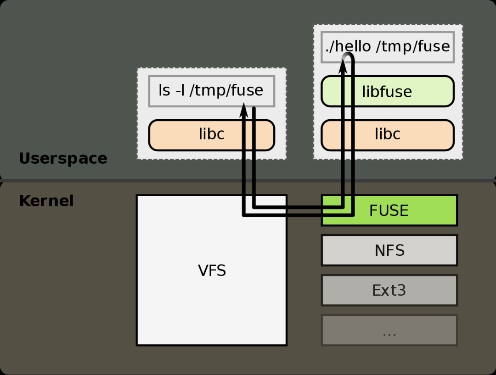
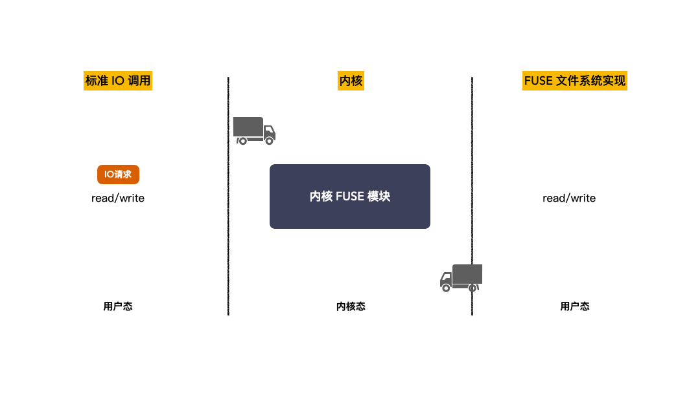

# dbfs with fuse interface

dbfs中提供了与系统无关的函数，可以同时支持我们使用rust实现的vfs接口，同时也可以支持fuse的接口。rust有fuse用户态的实现，因此可以方便地进行适配。

## Fuse







检测内核是否支持fuse:

```
modprobe fuse
```


## Project Layer


## Structure

```rust
bitflags! {
    pub struct DbfsPermission: u16 {
        const S_IFSOCK = 0o140000;
        const S_IFLNK = 0o120000;
        const S_IFREG = 0o100000;
        const S_IFBLK = 0o060000;
        const S_IFDIR = 0o040000;
        const S_IFCHR = 0o020000;
        const S_IFIFO = 0o010000;
        const S_ISUID = 0o004000;
        const S_ISGID = 0o002000;
        const S_ISVTX = 0o001000;
        const S_IRWXU = 0o700;
        const S_IRUSR = 0o400;
        const S_IWUSR = 0o200;
        const S_IXUSR = 0o100;
        const S_IRWXG = 0o070;
        const S_IRGRP = 0o040;
        const S_IWGRP = 0o020;
        const S_IXGRP = 0o010;
        const S_IRWXO = 0o007;
        const S_IROTH = 0o004;
        const S_IWOTH = 0o002;
        const S_IXOTH = 0o001;
    }
}
```

DBFS中的permission包含了文件类型与读写权限。在获取属性时，需要从permission中获取文件类型，而在创建文件时，需要从permission中获取读写权限。


## Interface implementation

```rust
getattr
lookup
chmod
chown
truncate
utimens
readlink
mkdir
unlink
rmdir
symlink
rename
link
open
read
write
flush
release
opendir
readdir
statfs
setxattr
getxattr
listxattr
removexattr
access
create
fallocate
copy_file_range
```


## Reference
[fuse接口的更详细说明](https://www.cs.hmc.edu/~geoff/classes/hmc.cs135.201109/homework/fuse/fuse_doc.html#readdir-details)

[ext4fuse](https://github.com/gerard/ext4fuse)

[fuse解析](https://www.zido.site/blog/2021-11-27-filesystem-in-user-space/)

https://man7.org/linux/man-pages/man7/inode.7.html

http://libfuse.github.io/doxygen/structfuse__operations.html#a8f5349c22f360bda57ff10d10486d148
